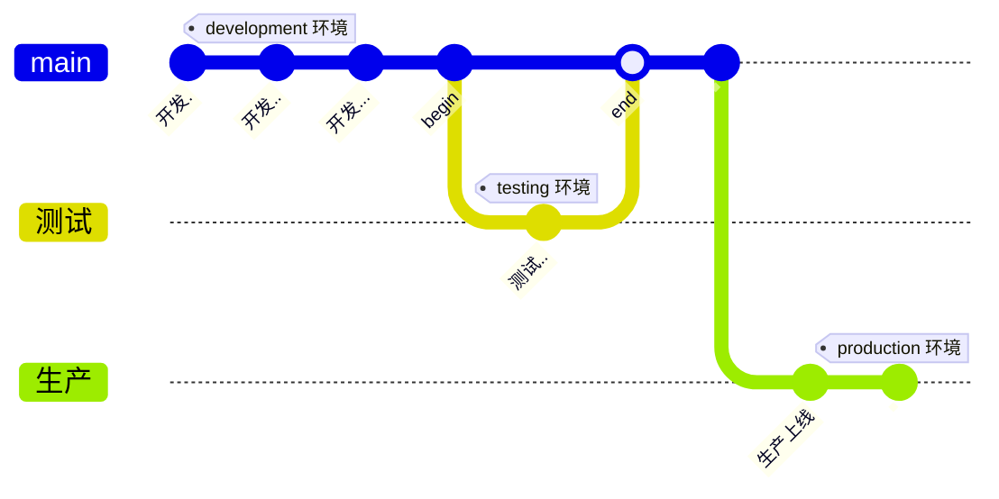

---

## Vue3 新型语法糖

> 在Vue 3项目中，`<script setup>` 和 `<script>` 是两种不同的脚本块，用于定义组件的逻辑。它们之间的区别在于语法和用法：

1. `<script setup>`:
   
   - 是一种新的语法糖，引入了Vue 3.1版本中的特性。
   - 主要用于组件的设置（setup）部分，用于配置组件的响应式数据、生命周期钩子、方法等。
   - 可以使用 `ref`、`reactive`、`readonly` 等函数来定义响应式数据。
   - 不需要像传统的 `<script>` 块那样显式导出组件选项，而是根据你在 `setup` 函数中返回的内容来推断组件选项。
   
       ```vue
       <template>
         <div>{{ message }}</div>
       </template>
       
       <script setup lang="ts">
       import { ref } from 'vue';
       
       const message = ref('Hello, Vue 3');
       
       // 不需要显式导出
       </script>
       ```
   
2. `<script>`:
   - 传统的组件脚本块，通常用于Vue 2或Vue 3之前的版本。
   - 需要显式导出组件选项，如 `export default { ... }`。
   - 在 `setup` 函数中，你需要手动设置响应式数据、方法等。

       ```vue
       <template>
         <div>{{ message }}</div>
       </template>
       
       <script lang="ts">
       import { ref } from 'vue';
       
       export default {
         setup() {
           const message = ref('Hello, Vue 3');
           return {
             message,
           };
         },
       };
       </script>
       ```
   

总的来说，`<script setup>` 提供了一种更简洁和更具可读性的方式来定义Vue 3组件，尤其是在使用TypeScript时。它可以减少样板代码，并且让组件的结构更清晰。但是，如果你更熟悉传统的 `<script>` 语法或需要更多的控制，你仍然可以使用传统的方式来定义组件。选择哪种方式取决于你的偏好和项目需求。

---

<small>`package.json`文件中此配置可以在项目运行时自动打开浏览器运行</small>

```json
{
    "scripts": {
        "dev": "vite --open"
    }
}
```

---

## 项目准备工作


### 解决TS不识别Vue

<u><span style="color: #a80f0f">报错原因：`Vite`使用的`ts`，而`ts`不识别`.vue`的后缀文件，在`main.ts`中引入`App.vue`就会报该错误！</span></u>

<small style="color: red">报错：TS2307: Cannot find module './App.vue' or its corresponding type declarations.</small>

==解决方法：==<u>在`App.vue`同级目录下的`vite-env.d.ts`（没有此文件就新建）文件中写入以下代码</u>

```typescript
declare module '*.vue' {
    import { DefineComponent } from 'vue'
    const component: DefineComponent<{}, {}, any>
    export default component
}
```

---

### 文件未包括在`tsconfig.json`中

在写`Vite`+`TypeScript`项目的时候莫名报错误 --  <small style="color: red;">xxx文件未包含再 tsconfig.json 中</small>

- **解决方法：**<u>在`tsconfig.json`文件中找到`"include"`进行配置</u>

- 将 xx文件 路径写入进去即可

    ```json
    {
        "include": ["vite.config.ts"]
    }
    ```

---

###  优化入口文件实例

应用实例没有存储在变量中，因此在后续的代码中无法直接访问该实例。这种方式通常用于非常简单的应用，或者在不需要在后续代码中引用应用实例的情况下使用。

```typescript
import { createApp } from 'vue'
import App from '@/App.vue'
...
createApp(App).mount('#app')
```

**优化后：**`app`变量存储了应用实例，这使得你可以在后续的代码中使用这个变量来执行其他操作，例如<u>添加全局组件、设置全局配置</u>等。这种方式有助于代码的可维护性，因为你可以更容易地对应用实例进行操作和管理。

```typescript
import { createApp } from 'vue'
import App from '@/App.vue'
...
const app = createApp(App)
...
app.mount('#app')
```


---

### Less

- 安装

    ```
    npm i less
    ```

    ```
    npm i less-loader
    ```

- 配置 `vite.config.ts`

    ```typescript
    export default defineConfig({
      plugins: [vue()],
        // 预处理器配置项
      css: {
        preprocessorOptions: {
          less: {
            math: "always"
          }
        }
      }
    })
    ```

---

### src 别名配置

*开发项目的时候文件与文件关系可能复杂，因此需要我们给`src`文件夹一个配置别名*

```typescript
/* vite.config.ts */
import path from 'path'
export default defineConfig({
    plugins: [
        vue()
    ],
    resolve: {
        alias: {
            "@": path.resolve('./src')							/* 用 '@' 替代 src */
        }
    }
})
```

`TypeScript`编译配置

```json
/* tsconfig.json */
"compilerOptions": {
    ...
    "baseUrl": "./",								        /* 解析非相对模块的基地址，默认是当前目录 */
    "paths": {									        /* 路径映射，相当于 baseUrl */
        "@/*": ["src/*"]
    }
}
```

---

### 环境变量配置

*在项目开发过程中会经历：**开发环境**、**测试环境**、**生成环境**（即正式环境）三个阶段，不同阶段请求的状态（**接口地址等**）不尽相同，若手动切换接口地址是相当繁琐容易出错的，于是环境变量的需求就孕育而生，我们只需简单的配置，把环境状态切换工作交给代码。*

**开发环境**（development）

开发使用的环境，开发人员在自己的`dev`分支上干活，同时合并代码进行联调。

**测试环境**（testing）

测试干活的环境，一般会由测试同事自己部署，然后在此环境进行测试

**生产环境**（production）

指正式提供对外服务的，一般会关掉错误报告，打开错误日志。（正式提供给客户使用的环境）

<small style="color: #845EC2"><u>注意：一个环境对应一台服务器</u></small>




项目根目录分别添加 **开发**、**测试**、**生产** 文件

```json
.env.development
.env.test
.env.production
```

文件内容	--	==必须以`VITE`开头才能暴露给外部读取==

```json
NODE_ENV = 'development'
VITE_APP_TITLE = '硅谷甄选运营平台'
VITE_APP_BASE_API = '/dev-api'
```

```json
NODE_ENV = 'test'
VITE_APP_TITLE = '硅谷甄选运营平台'
VITE_APP_BASE_API = '/test-api'
```

```json
NODE_ENV = 'production'
VITE_APP_TITLE = '硅谷甄选运营平台'
VITE_APP_BASE_API = '/prod-api'
```

配置运行命令 `package.json`文件中添加以下两个命令分别是进入**测试模式**、**生产模式**

```json
{
    "scripts": {
        "build:test": "vue-tsc && vite build --mode test",
    	"build:pro": "vue-tsc && vitebuild --mode production"
  	},
}
```


通过`import.meta.env`获取环境变量，可在`main.ts`入口文件测试：`console.log(import.meta.env)`


---

### SVG 配置

*`SVG`图标配置，在开发项目中会经常用到`SVG`矢量图，使用`SVG`后页面上加载的不再是图片资源，对性能来说是个极大的提升，`SVG`文件要比`Img`小很多，放在项目中几乎不占用资源。*

1. **安装 SVG 依赖插件**

    ```
    npm install vite-plugin-svg-icons -D
    ```

2. **`vite.config.ts`中配置**

    ```typescript
    import { createSvgIconsPlugin } from 'vite-plugin-svg-icons'
    
    export default defineConfig({
        plugins: [
            vue(),
            // SVG 配置
            createSvgIconsPlugin({
                iconDirs: [path.resolve(process.cwd(), 'src/assets/icons')],	/* SVG 文件需要放置到该目录中 */
                symbolId: 'icon-[dir]-[name]'
            }),
        ]
    })
    ```

3. 入口文件`main.ts`导入

    ```json
    import 'virtual:svg-icons-register'
    ```

4. 使用[icon font-阿里巴巴矢量图标库](https://www.iconfont.cn/?spm=a313x.collections_detail.i3.2.3f5a3a81Ki8Gxg)，直接下载图标或复制`SVG`代码，在项目中新建一个`svg`文件，将刚复制的`SVG`代码粘贴进去形成`svg`图标，<u>页面如何引入如下：</u>
    1. 准备一个外层容器节点`svg`，和内部`use`结合
    2. `use`中含有一个`xlink:href=""`属性指定用到哪一个`svg`文件
    3. `xlink:href=""`值的书写方式是：`#icon-`加上`svg`文件名
    
    ```vue
    <template>
    	<svg>
            <use xlink:href="#icon-concern"></use>
        </svg>
    </template>
    ```

<small>复制的`SVG`图标代码中含有控制图标**大小**、**颜色**、**透明度**等属性，可按需求修改</small>

<small>`SVG`代码如下:</small>

<svg t="1694854726252" class="icon" viewBox="0 0 1024 1024" version="1.1" xmlns="http://www.w3.org/2000/svg" p-id="1102" width="50" height="50"><path d="M0 0h1024v1024H0z" fill="#202425" opacity=".01" p-id="1103"></path><path d="M1001 512c0 270.068-218.932 489-489 489S23 782.068 23 512 241.932 23 512 23s489 218.932 489 489z" fill="#19A15F" p-id="1104"></path><path d="M512 23c180.978 0 338.975 98.324 423.527 244.5C850.975 413.676 692.977 512 512 512c-180.978 0-338.975-98.324-423.527-244.5C172.99 121.359 331.023 23 512 23z" fill="#A1D06B" p-id="1105"></path><path d="M512 226.293l484.411 345.43c-12.755 86.73-41.707 160.812-86.855 222.246-45.148 61.435-99.743 110.745-163.785 147.932L338.603 750.66l33.116-193.08-140.28-136.74 202.697-15.878L512 226.292z" fill="#128D51" opacity=".477" p-id="1106"></path><path d="M512 659.5l-173.397 91.16 33.116-193.08-140.28-136.74 193.863-28.17L512 217l86.698 175.67 193.864 28.17L652.28 557.58l33.116 193.08z" fill="#FFFFFF" p-id="1107"></path></svg>

---

#### 封装 SVG 组件

> 将`SVG`封装成 **全局组件**，项目中较多处使用，封装为组件更方便。

- 在`components`组件文件中新建`SvgIcons`文件夹存放`SVG`全局组件

    - `defineProps`接受父组件传递过来的参数：【<u>图标文件名、颜色、大小等</u>...】
    
    ```vue
    <template>
           <svg>
               <!-- 双向绑定 -->
               <use :xlink:href="prefix + name"></use>
           </svg>
       </template>
       
       <script setup lang="ts">
    
           defineProps({		                                            /* props */
               prefix: {							    /* xlink:href 属性值的前缀 */
                   type: String,					            /* 数据类型 */
                   default: '#icon-'		                            /* 默认值 */ 
               },
               name: String,					            /* 图标文件名 */
               color: {						            /* 图标颜色 */
                   type: String,
                   default: ''					            /* 默认空 */
               },
               width: {							    /* 宽度 */
            	   type: String,
            	   default: '16px'
               },
               height: {							    /* 高度 */
    
                   type: String,
            	   default: '16px'
               }
           })
       </script>
    ```
- 在`App.vue`中引入使用

    ```vue
    <template>
    <!-- 传入上面配置的 Props 参数 -->
        <SvgIcons
        	name=’concern‘
        	color=‘red’
        	width='20px'
        	height='20px'
        ></SvgIcons>
    </template>
    
    <script setup lang="ts">
        import SVGIcons from '@/components/SvgIcons/index.vue'		    /* 引入 */
    </script>
    ```
    
- 最后需要删除`SVG`文件代码中含有的`fill`、`width`、`height`等属性删除，因为`SVG`中已经存在的这些固定属性就无法修改

- `main.ts`入口文件中注册为`全局组件`

    ```typescript
    import { createApp } from 'vue'
    import './CommonStyle.css'
    import App from '@/App.vue'
    
    const app = createApp(App)
    
    import SvgIcons from '@/components/SvgIcons/index.vue'		            /* 引入 SvgIcons */
    app.component('SvgIcons', SvgIcons)				            /* 注册为全局组件 */
    
    app.mount('#app')
    
    ```


---

### 优化整个项目的全局组件

> 由于项目中会做很多全局组件，却只能通过`app.component()`挨个注册组件，导致`main.ts`入口文件中有非常多的`app.component()`，非常繁琐；因此我们将写一个<u>**自定义插件对象**</u>，注册整个项目的全局组件。

1. `component`文件夹中新建`index.ts`文件，对外暴露一个插件对象，内有`install`方法

    - `install(app)`会获取`app`应用实例
    - 因此我们可以在`install(){}`方法中使用`app.component()`注册整个项目的全局组件

    ```typescript
    import SvgIcons from '@/components/SvgIcons/index.vue'
    import pag from '@/components/Pagination/pag.vue'
    const allGlobalComponent = { SvgIcons, pag }				    /* 全局对象 */
    /*
    * ES6 语法 Object.keys()
    * 它会得到对象中所有的 key 并放到数组里
    */
    console.log(Object.keys(allGlobalComponent))				    /* ['SvgIcons', 'pag'] */
    export default {
        install(app: {}):void {					            /* 接受 app 的所有实例 */
            console.log(app)
            Object.keys(allGlobalComponent).forEach(key => {	            /* 根据数组里的 key 挨个注册全局组件 */
                app.component(key, allGlobalComponent[key])		            /* 注册全局组件 */
            })
        }
    }
    
    ```

2. `main.ts`引入自定义插件

    ```typescript
    ...
    import globalComponent from '@/components/index.ts'		            /* 引入文件 */
    app.use(globalComponent)						    /* 安装使用 */
    
    app.mount('#app')
    ```


---

### mock.js

> `mock.js`模拟搭建后端数据接口，模拟真实数据环境下渲染项目。实际上接口和数据都是假的。

安装依赖`mock.js`

```
npm install mockjs -S
```

安装插件`vite-plugin-mock`，并指定`2.9.6`版本，<small style="color: red;">若安装以上版本，后续操作将会报错</small>

```
npm install -D vite-plugin-mock@2.9.6
```

使用前的配置`vite.config.ts`

```typescript
/*
*   'vite-plugin-mock' 会报类型声明错误，不影响运行，但还是用 @ts-ignore 跳过检查
*/
// @ts-ignore
import { viteMockServe } from 'vite-plugin-mock'				/* 从插件中引入一个 viteMockServe 函数 */

// 暴露一个箭头函数，函数返回一个配置对象【在原有 defineConfig 上修改】
export default defineConfig(({ command })=>{
    /*
    *   command -> 获取当前开发环境
    */
    rertun {
        plugins: [
            vue(),
            viteMockServe({
                mockPath: 'mock',
                localEnabled: command === 'serve'			        /* 保证开发阶段可以使用 mock 接口 */
            })
        ]
    }
})
```

- 项目根目录下建立`mock`文件夹，`mock`接口和数据都写在一起.

```ts
interface userList {
    userID: number,
    avatar: string,
    userName: string,
    password: string,
    desc: string,
    roles: string[],
    buttons: string[],
    routes: string[],
    token: string
}
/*
*	createUserList() 函数每执行一次就会返回一个数组，数组中的对象写有项目将用到的 mock 数据
*/
function createUserList(): userList[]{
    return [
        {
            userID: 1,
            avatar: '/asd/efd/sc/3333.jpg',
            userName: 'Fendi',
            password: '111',
            desc: '平台管理员',
            roles: ['平台管理员'],
            buttons: ['cuser.detail'],
            routes: ['home'],
            token: 'Admin Token'
        },
        {
            userID: 2,
            avatar: '/asd/efd/sc/2222.jpg',
            userName: 'admin',
            password: '666',
            desc: '平台成员',
            roles: ['平台成员'],
            buttons: ['user.detail'],
            routes: ['home'],
            token: 'user Token'
        }
    ]
}
/*
*	对外暴露一个数组，数组中包含的是 mock 接口
*/
export default [
    {
        url: '/api/user/login',					                /* 接口地址 */
        method: 'post',							        /* 请求类型 */
        response: ({ body })=>{
            const { username, password } = body		                        /* 获取请求体携带过来的用户名和密码 */
            /*
            *   调用 createUserList 函数，判断是否由此用户
            *   .find() 是数组的方法之一，用于查找符合指定条件的第一个元素，并返回该元素。
            *   在这里，它用来查找具有特定用户名 (username) 和密码 (password) 的用户。
            *   .find() 接受一个回调函数作为参数，该函数用于定义查找条件。在这个回调函数中，传入的参数 item 是列表中的每个元素。
            *   条件 item.userName === username 被用来检查当前元素是否符合所需的用户名
            */
            const checkUser = createUserList().find((item)=>item.userName === username && item.password === password)
            if (!checkUser){					                /* checkUser 没有值则返回失败信息 */
                return { code: 201, data: { message: "账户密码不正确！！" } }
            }
            const {token}  = checkUser
            return { code: 200, data: {token} }	                                /* 服务器返回成功数据信息 */
        }
    },
    {
        url: '/api/user/info',
        method: 'get',
        response: (request)=>{
            const token = request.headers.token
            const checkUser = createUserList().find((item)=>item.token === token)
            if (!checkUser) return { code: 201, data: { message: "获取用户信息失败" } }
            return { code: 200, data: { checkUser } }
        }
    }
]

```

- 测试接口能否使用，`main.ts`入口文件中直接使用测试

```
npm install axios
```

```tsx
...
import axios from 'axios'							/* 引入 axios */
axios({
    url: '/api/user/login',							/* 接口地址 */
    method: 'post',							        /* 请求类型 */
    data: {								        /* 接口参数 */
        username: 'Fendi',
        password: '1111'
    }
})
...
app.mount('#app')
```

---

### axios 二次封装

*二次封装`axios`，便于后续对接后端接口做一些处理*

**目的：**能够使用`请求拦截器`、`响应拦截器`

- **请求拦截器**：<u>可以在请求拦截器中处理一些业务【开始进度条、请求头携带公共参数...】</u>
- **想要拦截器**：<u>可以在响应拦截器中处理一些业务【结束进度条、简化服务器返回的数据、处理`http`网络错误...】</u>

**操作：**

1. 在`src`目录下建立`utils\request.ts`对`axios`进行二次封装

    ```typescript
    import axios from 'axios'					            /* 引入 axios */
    
    // 第一步：利用 axios 对象的 create 方法，去创建 request = axios 实例（其他配置：基础路径、超时的时间）
    // 此时 request 也是 axios 的实例，并携带有其他配置（拦截器等...）
    let request = axios.create({
        baseURL: import.meta.env.VITE_APP_BASE_API,	                            /* 接口的前缀路径【接口地址会携带 /xxx 前缀】 */
        timeout: 5000							    /* 超时时间（发起一个请求无论成功或失败，超过5s都算失败） */
    })
   ```
   
    <small>`import.meta.env.VITE_APP_BASE_API`获取的是 [.env 环境变量配置][环境变量配置] 中的 `VITE_APP_BASE_API`的值</small>
   
    ```typescript
    // 第二步：给 request 实例添加请求拦截器和响应拦截器
    //	实例.拦截器.请求.使用
    request.interceptors.request.use((config)=>{			            /* 拦截器触发时，它的回调函数会传进一个 config 配置对象，headers 请求头，常给服务端携带公共参数 */
        return config					                    /* 必须返回，否则会有报错 */
   })
    ```
   
   ```typescript
   // 响应拦截器
   /*
   *	响应拦截器有两个回调函数 response / error【成功 / 失败】
   *	response 成功回调：会返回服务器返回的数据
   *	error 失败回调：会返回错误的对象，处理 http 网络错误
   */
   request.interceptors.response.use(
       (response)=>{
           return response.data
       },
       (error)=>{
           let message = ''					            /* message - 储存错误信息 */
           let status = error.response.status				    /* http 状态码 */
           switch (status) {
               case 401:
                   message = 'Token 过期'
                   break
               case 403:
                   message = '您没有权利访问，无权访问'
                   break
               case 404:
                   message = '请求地址错误'
                   break
               case 500:
                   message = '服务器出现问题'
                   break
               default:
                   message = '网络问题'
                   break
           }
           return Promise.reject(error)					    /* 返回一个失败的 Promise 对象 */
       }
   )
   export default request							    /* 将 request 暴露出去 */
   ```

> 二次封装`axios`后`request`和`axios`都是`axios`的实例，不同的是`request`包含有 **请求拦截器** 和 **响应拦截器** 等其他配置...

2. 在`App.vue`中测试`axios`二次封装的响应拦截器是否可用

    ```vue
    <script setup lang="ts">
        import request from '../utils/request.ts'				    /* 引入 request  */
        import { onMounted } from 'vue'					    /* Vue3 组合式 API onMounted() */
        onMounted(()=>{
            request({							    /* 发请求 */
                url: '/api/user/login',					    /* 由于前面配置了请求路径的前缀/xxx，所以会报404路径错误，测试时去掉/api前缀即可 */
                method: 'POST',
                data: {							    /* 携带的name/password参数 */
                    username: 'Fendi',
                    password: '111'
                }
            }).then(res=>{						            /* 成功回调，获取服务器返回的数据 res */
                console.log(res)
            })
        })
    </script>
    ```


---

### API 接口管理

> `src`目录下新建`api`文件夹存放项目中使用的接口，统一管理项目中的接口，便于维护和管理

<u>**接口管理需要两个`ts`文件（`index.ts`、`indexType.ts`），写配置接口，另一个则定义接口参数和携带的数据的数据类型**</u>

以下是`login`登录接口和`userInfo`获取用户数据接口

`indexType.ts`（login）

```typescript
/*
*	根据接口所需的参数再定义数据类型
*	以下数据类型是根据以上 mock.ts 中的 /user/login 和 /userInfo 接口中传入的数据和返回数据而制定的
*
*	/login 接口需要携带数据 {username, password}
*	服务器返回的数据 { code: 200, data: {token} }，只有 状态码 和 token
*/
export interface loginType {							/* 类型接口 - login 接口携带的数据 */
    username: string,
    password: string
}

export interface loginResponseData {					        /* 类型接口 login 接口服务器返回数据 */
    code: number,
    data: {
        token: string
    }
}
...
```

`indexType.ts`（userInfo）

```typescript
...
/*
*	/userInfo 只有服务器返回的数据 {code: 200, data: { checkUser }} 只有 状态码 和 checkUser用户数据
*	
*/
interface userInfo {								/* 服务器返回的数据 */
    userID: number,
    avatar: string,
    userName: string,
    password: string,
    desc: string,
    roles: string[],
    buttons: string[],
    routes: string[],
    token: string
}
export interface userResponseData {						/* 类型接口 - 服务器返回的用户数据 */
    code: number,
    data: {
        checkUser: userInfo
    }
}
```

`index.ts`

```typescript
import request from '@/utils/request.ts'			                /* 引入前面封装的 axios 实例 */
// 引入定义的类型接口
import type {loginType, loginResponseData, userResponseData} from '@/api/user/type.ts'

enum API {								        /* 枚举类型，类似于 JS 对象，通过 `.` 获取属性值 */
    LOGIN_URL = '/user/login',					                /* 接口地址 */
    USERINFO_URL = '/user/info'					                /* 接口地址 */
}

/*
*	暴露 登录/获取信息 接口，传入data参数含有name和password参数，并发起 post(接口地址，数据) 请求，
*	定义传入数据和服务器返回数据的数据类型 loginType / loginResponseData / userResponseData
*/
export const reqLogin = (data: loginType) => request.post<any, loginResponseData>(API.LOGIN_URL, data)
export const reqUserInfo = () => request.get<any, userResponseData>(API.USERINFO_URL)
```

测试 **API** 接口

```vue
<script setup lang="ts">
    import {reqLogin} from '@/api/indexType.ts'				        /* 引入 API 接口 */
    import {onMounted} from 'vue'					        /* Vue3 API组件 */
    onMounted(()=>{
        reqLogin({								/* 调用接口发起请求 */
            username: 'Fendi',							/* 传入定义好的数据 */
            password: '111'
        })
    })
</script>
```

---

### 路由配置

安装`vue-router`集成

```
npm install vue-router
```

再`src`目录下新建`router/index.ts`路由文件配置项目中用到的路由模块

```typescript
// 通过 vue-router 实现模板路由配置
import {createRouter, createWebHistory} from 'vue-router'

let router = createRouter({							/* 创建路由器 */
    history: createWebHistory(),						/* 路由模式 - hash模式 */
    scrollBehavior(){								/* 滚动行为，跳转路由时水平方向垂直方向都为 0 */
        return {
            left: 0,
            top: 0
        }
    },
    routes: [								        /* 配置路由 */
        {
            path: '/',								/* 首页路由 */
            component: ()=>import('@/views/Home.vue'),		                /* 路由懒加载 */
            name: 'Home'							/* 命名路由 */
        },
        {
            path: '/404',
            component: ()=>import('@/views/404.vue'),
            name: '404'
        },
        ...
        {
            path: '/:pathMatch(.*)*',					        /* 任意路由，上面配置的路由都没有匹配上就启用这个任意路由 */
            redirect: '/404',							/* 重定向到某个路由 */
            name: 'Any'
        }
    ]
})

export default router
```

`main.ts`入口文件注册路由

```typescript
import router from '@/router/index.ts'
...
app.use(router)									/* 注册路由 */
```

---
